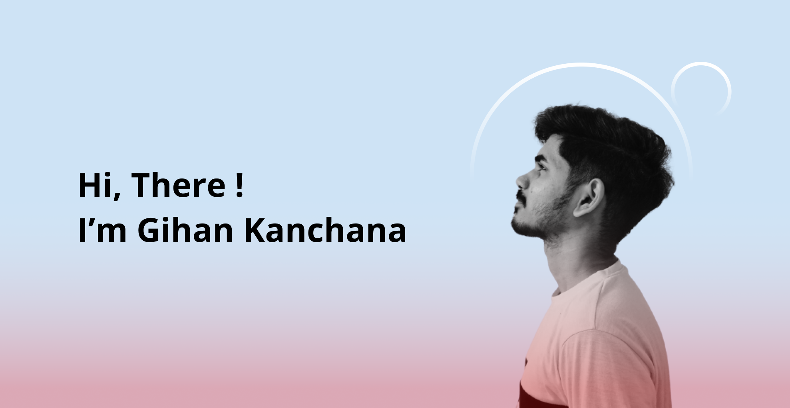

<h1 align="center">
    
</h1>

<h3 align="center">Software developer from Sri lanka  LK</h3>

 

 
 🔭 I’m an Undergraduate student at IIT affiliated with the University of Westminster.
 
 🌱 I’m currently learning **Django, Kotlin, AWS**

⚡ Fun fact **Game of Thrones Night's Watch cloaks are made from Ikea rugs**

 

 

 
  
  <a href="[https://salesp07.github.io](https://github.com/GkazyG)" target="_blank">
      <!-- sqlite, safari, google-chrome are other good icon options -->
  </a>

 

 
<h2 align="center">⚒️ Languages-Frameworks-Tools ⚒️</h2>
 

    
     

 

